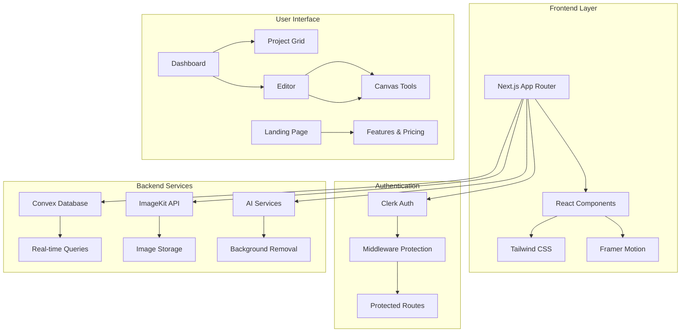
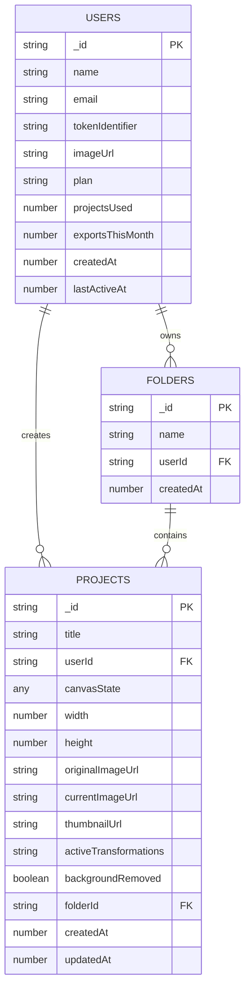
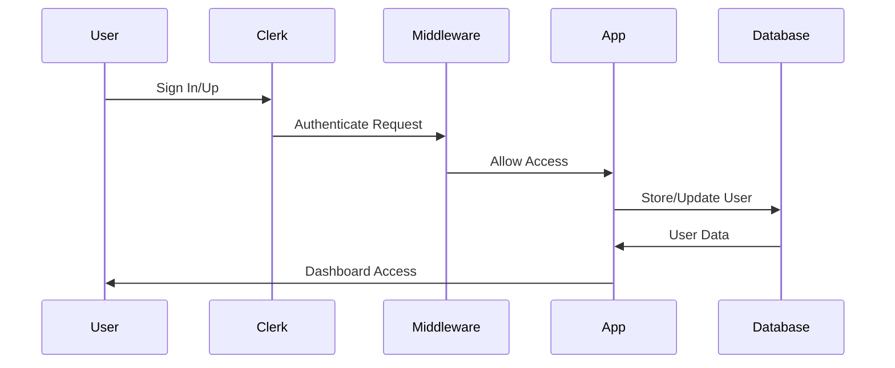

# 🎨 Imageez.io - AI-Powered Image Editor

<div align="center">


**Professional image editing powered by AI** 🚀

[](https://nextjs.org/)
[](https://reactjs.org/)
[](https://convex.dev/)
[](https://clerk.com/)
[](https://tailwindcss.com/)

</div>

## 📋 Table of Contents

- [🌟 Overview](#-overview)
- [✨ Features](#-features)
- [🏗️ Architecture](#️-architecture)
- [🛠️ Tech Stack](#️-tech-stack)
- [📁 Project Structure](#-project-structure)
- [🚀 Getting Started](#-getting-started)
- [🔧 Environment Setup](#-environment-setup)
- [ Database Schema](#-database-schema)
- [🎯 Key Components](#-key-components)
- [🔐 Authentication Flow](#-authentication-flow)
- [📱 API Endpoints](#-api-endpoints)
- [🎨 Editor Tools](#-editor-tools)
- [💳 Pricing Plans](#-pricing-plans)
- [🚀 Deployment](#-deployment)
- [🤝 Contributing](#-contributing)
- [📄 License](#-license)

## 🌟 Overview

**Imageez.io** is a cutting-edge, AI-powered image editing platform that brings professional-grade image manipulation tools to the web. Built with modern technologies, it offers an intuitive interface for cropping, resizing, color adjustment, background removal, and AI-enhanced editing capabilities.

### 🎯 Key Highlights

- 🤖 **AI-Powered Editing**: Advanced AI for background removal and content editing
- 🎨 **Professional Tools**: Crop, resize, adjust colors, and enhance images
- ☁️ **Cloud Storage**: Secure image storage with ImageKit integration
- 🔐 **Secure Authentication**: Clerk-powered user management
- 📱 **Responsive Design**: Modern UI with dark theme support
- ⚡ **Real-time Processing**: Instant preview and processing
- 💰 **Flexible Pricing**: Free and Pro plans with usage limits

## ✨ Features

### Core Editing Tools

- **✂️ Smart Crop & Resize**: Interactive cropping with aspect ratio constraints
- **🎨 Color & Light Adjustment**: Professional-grade brightness, contrast, saturation controls
- **🤖 AI Background Removal**: Instant background removal using advanced AI
- **🔧 AI Content Editor**: AI-powered content manipulation and enhancement
- **📐 Aspect Ratio Control**: Multiple predefined aspect ratios
- **🖼️ Canvas Management**: Flexible canvas sizing and management

### Advanced Features

- **☁️ Cloud Storage**: Secure image storage with ImageKit
- **📊 Project Management**: Organize projects in folders
- **🔄 Real-time Sync**: Live updates across sessions
- **📱 Responsive Design**: Works on desktop and mobile
- **🌙 Dark Theme**: Modern dark UI with theme switching
- **⚡ Performance**: Optimized for speed and efficiency

## 🏗️ Architecture



## 🛠️ Tech Stack

### Frontend

- **⚛️ React 19.1.0** - Latest React with concurrent features
- **🚀 Next.js 15.4.6** - App Router with Turbopack
- ** Tailwind CSS 4.0** - Utility-first CSS framework
- **🎭 Framer Motion** - Smooth animations and transitions
- **🎯 Radix UI** - Accessible component primitives
- **🎨 Lucide React** - Beautiful icon library

### Backend & Services

- **🗄️ Convex** - Real-time database and backend
- **🔐 Clerk** - Authentication and user management
- **☁️ ImageKit** - Image storage and optimization
- **🤖 AI Services** - Background removal and content editing

### Development Tools

- ** Package Manager**: npm
- **🔍 Linting**: ESLint with Next.js config
- **🎨 Styling**: Tailwind CSS with PostCSS
- **📱 Icons**: Lucide React icons

## 📁 Project Structure

```
imageez.io/
├── 📁 app/                          # Next.js App Router
│   ├── 📁 (auth)/                   # Authentication routes
│   │   ├── sign-in/                 # Sign-in pages
│   │   └── sign-up/                 # Sign-up pages
│   ├── 📁 (main)/                   # Main application routes
│   │   ├── dashboard/               # Project dashboard
│   │   └── editor/[projectId]/      # Image editor
│   ├── 📁 api/                      # API routes
│   │   └── imagekit/upload/         # Image upload endpoint
│   └── layout.js                    # Root layout
├── 📁 components/                   # Reusable components
│   ├── 📁 ui/                       # UI component library
│   ├── Hero.jsx                     # Landing page hero
│   ├── Features.jsx                 # Features section
│   ├── Pricing.jsx                  # Pricing plans
│   └── Header.jsx                   # Navigation header
├── 📁 convex/                       # Convex backend
│   ├── schema.js                    # Database schema
│   ├── projects.js                  # Project mutations/queries
│   └── users.js                     # User management
├── 📁 hooks/                        # Custom React hooks
├── 📁 context/                      # React context providers
├── 📁 lib/                          # Utility functions
└── 📁 public/                       # Static assets
```

## 🚀 Getting Started

### Prerequisites

- **Node.js** 18+
- **npm** or **yarn**
- **Convex** account
- **Clerk** account
- **ImageKit** account

### Installation

1. **Clone the repository**

   ```bash
   git clone https://github.com/your-username/imageez.io.git
   cd imageez.io
   ```

2. **Install dependencies**

   ```bash
   npm install
   # or
   yarn install
   ```

3. **Set up environment variables**

   ```bash
   cp .env.example .env.local
   ```

4. **Start the development server**

   ```bash
   npm run dev
   # or
   yarn dev
   ```

5. **Open your browser**
   Navigate to [http://localhost:3000](http://localhost:3000)

## 🔧 Environment Setup

Create a `.env.local` file with the following variables:

```env
# Clerk Authentication
NEXT_PUBLIC_CLERK_PUBLISHABLE_KEY=your_clerk_publishable_key
CLERK_SECRET_KEY=your_clerk_secret_key
NEXT_PUBLIC_CLERK_SIGN_IN_URL=/sign-in
NEXT_PUBLIC_CLERK_SIGN_UP_URL=/sign-up

# Convex Database
CONVEX_DEPLOYMENT=your_convex_deployment_url
NEXT_PUBLIC_CONVEX_URL=your_convex_url

# ImageKit Storage
NEXT_PUBLIC_IMAGEKIT_PUBLIC_KEY=your_imagekit_public_key
IMAGEKIT_PRIVATE_KEY=your_imagekit_private_key
NEXT_PUBLIC_IMAGEKIT_URL_ENDPOINT=your_imagekit_url_endpoint

# AI Services (if applicable)
AI_API_KEY=your_ai_service_key
```

## 📊 Database Schema



## 🎯 Key Components

### 🏠 Landing Page Components

- **Hero Section**: Animated hero with call-to-action
- **Features Grid**: Interactive feature showcase
- **Pricing Plans**: Free and Pro plan comparison
- **Stats Counter**: Animated statistics display

### 📊 Dashboard Components

- **Project Grid**: Visual project management
- **New Project Modal**: Project creation interface
- **Project Cards**: Individual project previews

### Editor Components

- **Canvas Editor**: Main editing interface
- **Tool Sidebar**: Editing tools and controls
- **Top Bar**: Project info and actions
- **Tool Panels**: Specific tool interfaces

## 🔐 Authentication Flow



## API Endpoints

### 🔐 Authentication Routes

- `POST /api/auth/signin` - User sign in
- `POST /api/auth/signup` - User registration
- `POST /api/auth/signout` - User sign out

### 🖼️ Image Management

- `POST /api/imagekit/upload` - Upload image to ImageKit
- `GET /api/imagekit/transform` - Transform image with parameters

### 📊 Project Management

- `GET /api/projects` - Get user projects
- `POST /api/projects` - Create new project
- `PUT /api/projects/:id` - Update project
- `DELETE /api/projects/:id` - Delete project

## 🎨 Editor Tools

### ️ Available Tools

1. **📐 Resize Controls**: Adjust canvas dimensions
2. **✂️ Crop Content**: Smart cropping with constraints
3. ** Adjust Controls**: Color and light adjustments
4. **🤖 AI Edit**: AI-powered content editing
5. **🖼️ Background Controls**: Background removal/replacement
6. **📝 Text Controls**: Add and edit text elements
7. **🔧 AI Extender**: AI-powered image extension

### Tool Features

- **Real-time Preview**: Instant visual feedback
- **Undo/Redo**: Full history management
- **Keyboard Shortcuts**: Power user features
- **Export Options**: Multiple format support

## Pricing Plans

### 🆓 Free Plan

- ✅ 5 projects maximum
- ✅ Basic editing tools
- ✅ Standard image processing
- ✅ Community support

### 💎 Pro Plan

- ✅ Unlimited projects
- ✅ Advanced AI tools
- ✅ Priority processing
- ✅ Premium support
- ✅ Export in multiple formats
- ✅ Advanced transformations

## 🚀 Deployment

### Vercel Deployment (Recommended)

1. **Connect to Vercel**

   ```bash
   npm i -g vercel
   vercel login
   vercel
   ```

2. **Set Environment Variables**
   Add all required environment variables in Vercel dashboard

3. **Deploy**
   ```bash
   vercel --prod
   ```

### Manual Deployment

1. **Build the application**

   ```bash
   npm run build
   ```

2. **Start production server**
   ```bash
   npm start
   ```

## 🤝 Contributing

We welcome contributions! Please follow these steps:

1. **Fork the repository**
2. **Create a feature branch**
   ```bash
   git checkout -b feature/amazing-feature
   ```
3. **Commit your changes**
   ```bash
   git commit -m 'Add amazing feature'
   ```
4. **Push to the branch**
   ```bash
   git push origin feature/amazing-feature
   ```
5. **Open a Pull Request**

### 🎯 Contribution Guidelines

- Follow the existing code style
- Add tests for new features
- Update documentation
- Ensure all tests pass

## 📄 License

This project is licensed under the MIT License - see the [LICENSE](LICENSE) file for details.

---

<div align="center">

**Built with ❤️ by the Imageez.io Team**

[🌐 Website](https://imageez-io.vercel.app/) • [📧 Contact](mailto:bismaybibhabasu33@gmail.com) • [🐛 Report Bug](https://github.com/its-bismay/Imageez.io/issues) • [💡 Request Feature](https://github.com/its-bismay/Imageez.io/issues)

</div>
